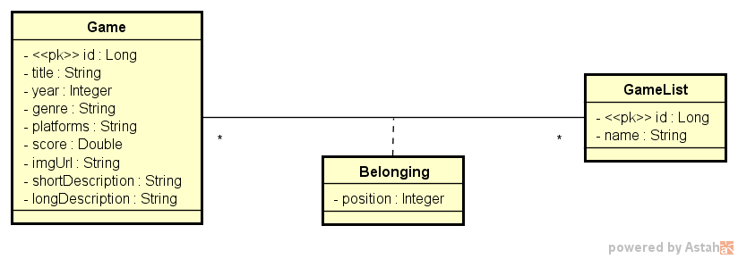

# Java Spring [dslist]
Lecionado pelo Prof. [Nelio Alves](https://www.linkedin.com/in/nelio-alves/)

## Descrição
O projeto **dslist**  é um projeto Java Spring desenvolvido durante um evento de Java Spring, que ocorreu nos dias 18 à 22 de Agosto de 2025. 

O projeto tem como objetivo criar uma aplicação web para gerenciar listas de jogos.

## Modelo de domínio DSList


## Funcionalidades

- **Busca**: Implementação de algoritmos de busca, como busca linear e binária.
- **Gerenciamento de Listas**: Implementação de listas encadeadas e outras estruturas de dados.
- **Ordenação**: Algoritmos de ordenação aplicados às listas.

## Tecnologias Utilizadas
- **Postgresql 12 e pgAdmin 4**: Banco de dados
- **Git e Github**: Versionamento do código.
- **Java**: Linguagem de programação principal.
- **Maven**: Gerenciamento de dependências e construção do projeto.
- **Postman**: Fazer requisições para API.
- **Railway**: Hospedagem na Nuvem.
- **VSCode**: Editor de código fonte.

## Requisitos
- **Java 17**
- **Windows 10 ou superior**

## Como usar?
1. Clone o repositório
```bash
   git clone https://github.com/satoosan/dslist.git
```

2. Navegue até o diretório do projeto:
```bash
   cd dslist
```

**obs**: A partir daqui o tutorial irá funcionar melhor no VSCode, que foi o qual eu utilizei para desenvolver esse projeto.

3. No VSCode, instale as extensões para o Java e Spring.

4. Na seção Explorer ou Explorar, em Java Projects, terá um item **dslist**, com o botão direito do mouse, vá em Run. Após isso a aplicação já deve estar rodando.

5. Para testar:
   - No navegador, localhost:8080. Se aparecer "Whitelabel Error Page", a aplicação está rodando sem problemas.
   - Fazer requisições:
      - Existem 4 requições Get e uma Post, sendo elas (insiria seu host em {{**host**}}):
         - {{host}}/games (Lista os games)
         - {{host}}/games/id (Busca os games pelo ID)
         - {{host}}/lists (Lista as categorias dos games)
         - {{host}}/lists/id/games (Listas os games que estão dentro de uma categoria)
         - {{host}}/lists/id/replacement (Atualiza a posição do game dentro de uma lista)
      - Colocando essas URLs, é possível fazer as requisiçoes.
      - No Postman, importe o arquivo, ```DSList.postman_collection.json```, crie uma variável host para poder utilizar.
         - No caso o ```current value``` insira o localhost ou a URL, https://dslist-production-f8d8.up.railway.app
         - Com isso já deve ser possível fazer as requisições, sem problemas.

## 

Link para a API: https://dslist-production-f8d8.up.railway.app/

Criado por [Guilherme Kimura](https://github.com/satoosan)